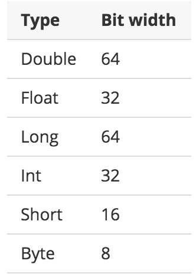

## 기본 타입

코틀린은 모든 것이 객체라서 변수에 대해 멤버 함수나 프로퍼티를 사용할 수 있습니다. 최적화 목적의 일부 타입을 제공하고 있지만 사용자에게는 일반 클래스와 같습니다. 이 페이지에서는 이 타입 중 숫자, 문자, 부울, 배열에 대해 설명합니다.

### numbers

Kotlin은 Java와 유사한 방법으로 숫자를 다루지만 완전히 동일한 것은 아닙니다. 예를 들어, 숫자의 경우 큰 범위로의 자동 변환이 없고, 리터럴은 경우에 따라 약간 다릅니다.

코틀린은 숫자를 위해 다음의 내장 타입을 제공합니다.(자바와 유사)

Kotlin에서 문자는 숫자가 아닙니다.

#### literal constants

정수 값에 대해 다음의 리터럴 상수가 존재합니다.

- 이진법 : 0b00001011
- 16진법 : 0x0F
- 십진법 : 123
  - Long은 대문자 'L'을 붙인다 : 123L

주의 : 8진법 리터럴은 지원하지 않습니다.

Kotlin은 또한 실수에 대해 다음 표기법을 지원합니다.

- 기본은 Double : 123.5, 123.5e10
- f나 F를 붙여 Float 표현 : 123.5f

#### representation

Java 플랫폼에서는 물리적으로 JVM 기본 타입으로 숫자를 보관합니다. nullable 숫자 참조(예 : Int?)가 필요하거나 제네릭과 연관이 있다면 박싱 타입을 사용합니다.

숫자를 박싱하면 참조 동일성(identitiu)은 유지되지 않는 것에 주의해야 합니다.

~~~kotlin
val a: Int = 10000

print(a === a) // 'true' 출력

val boxedA: Int? = a
val anotherBoxedA: Int? = a

print(boxedA === anotherBoxedA) // 'false' 출력
~~~

반면에 값 동등성(equality)은 유지됩니다.

~~~kotlin
val a: Int = 10000

print(a == a) // 'true' 출력

val boxedA: Int? = a
val anotherBoxedA: Int? = a

print(boxedA == anotherBoxedA) // 'true' 출력
~~~

#### explicit conversions

표현이 다르기 때문에 작은 범위 타입은 큰 범위 타입의 하위 타입이 아닙니다. 만약 하위 타입이 된다면 다음과 같은 상황에서 문제가 됩니다.

~~~kotlin
// 가상의 코드로, 실제로는 컴파일되지 않습니다.
val a: Int? = 1 // Int의 박싱타입.(java.lang.Integer)
val b: Long? = a // Long의 박싱타입(java.lang.Long)을 만드는 자동 타입 변환.

print(a == b) // Long의 equals()는 비교 대상이 Long인지 검사하기 때문에 'false'가 출력됩니다.
~~~

따라서, 동일성(identitiy)뿐만 아니라 모든 곳에서 동등성(equality)까지 잃게 될 수 있습니다.

이런 까닳에 작은 타입을 큰 타입으로 자동 변환하지 않습니다. 이는 명시적 변환없이  Byte 값을 Int 변수에 할당할 수 없음을 의미합니다.

~~~kotlin
val b: Byte = 1 // OK, 리터럴은 정적으로 검사한다.
val i: Int = b // 에러.
~~~

큰 범위 숫자로 명시적으로 타입 변환을 할 수 있습니다.

~~~kotlin
val i: Int = b.toInt() // Ok, 명시적으로 큰 범위 타입으로 변환
~~~

모든 숫자 타입은 다음 변환을 지원합니다.

- toByte(): Byte
- toShort(): Short
- toInt(): Int
- toLong(): Long
- toFloat(): Float
- toDouble(): Double
- toChar(): Char

문맥에서 타입을 추론할 수 있고 수치 연산자를 각 타입 변환에 맞게 오버로딩했기 때문에, 자동 타입 변환이 없어도 거의 문제가 되지 않습니다.

~~~kotlin
val 1 = 1L + 3 // Long + Int => Long
~~~

#### operations

Kotlin은 숫자에 대한 표준 수치 연산을 지원합니다. 이 연산자는 각 타입의 멤버로 정의되어 있습니다.

비트 연산의 경우 이를 위한 특수 문자를 사용하지 않고 중위 형식으로 호출할 수 있는 함수가 존재합니다. 다음은 예입니다.

~~~kotlin
val x = (1 shl 2) and 0x000FF000
~~~

다음은 전체 비트 연산 목록입니다.(Int 와 Long 만 가능.)

- shl(bits) - 부호 가진 좌측 쉬프트(Java의 <<)
- shr(bits) - 부호 가진 우측 쉬프트(Java의 >>)
- ushr(bits) - 부호 없는 오른 쪽 쉬프트(Java의 >>>)
- and(bits) - and 비트 연산
- or(bits) - or 비트 연산
- xor(bits) - xor 비트 연산
- inv() - 역 비트 연산

### characters

 Char 타입으로 문자를 표현합니다. 문자를 숫자로 다룰 수 없습니다.

~~~kotlin
fun check(c: char){
    if(c == 1){ // 에러: 호환되지 않는 타입.
        // ...
    }
}
~~~

문자 리터럴은 단일 따옴표 안에 위치합니다. : '1'. 특수 문자는 역슬래시를 이용해서 표시합니다. 지원하는 이스케이프 시퀀스는 다음과 같습니다. : \t, \b,\n, \r. 다른 문자를 인코딩하려면 유니코드 이스케이프 시퀀스 구문을 사용합니다. : '\uFF00'

문자를 Int 숫자로 변환할 수 있습니다.

~~~kotlin
for decimalDigitValue(c: char): Int{
    if(C !IN '0'..'9'){
        throw IllegalArgumentException("Out of range")
    }
    
    return c.toInt() - '0'.toInt() // 숫자로 변환
}
~~~

숫자처럼 nullable 참조가 필요하면 문자를 박싱합니다. 박싱 연산은 동일성(identity)을 유지하지 않습니다.

### boolean

Boolean 타입은 부울을 표현하며 true 와 false 의 두 값을 갖습니다.

nullable 참조가 필요하면 Boolean을 박싱합니다.

부울 타입의 내장 연산은 다음과 같습니다.

- || - lazy 논리 합(disjunction)
- && - lazy 논리 곱(conjunction)
- ! - 부정

### arrays

Kotlin은  Array 클래스를 이용해서 배열을 표현합니다. 이 클래스는 get 과 set 함수와 size 프로퍼티를 가지며 몇 개의 다른 유용한 멤버 함수가 있습니다. 

~~~kotlin
class Array<T> private constructor(){
    val size: Int
    operator fun get(index: Int): T
    operator fun set(index: Int, value: T): Unit
    
    operator fun iterator(): Iterator<T>
    // ...
}
~~~

arrayOf() 라이브러리 함수를 이용해서 배열을 생성합니다. 이 함수에 값 목록을 제공합니다. 예를 들어, arrayOf(1, 2, 3)은 [1, 2, 3] 배열을 생성합니다. arrayOfNulls() 라이브러리 함수를 사용하면 null을 값으로 갖는 지정한 크기의 배열을 생성합니다.

팩토리 함수를 사용할 수도 있습니다. 팩토리 함수는 배열 크기와 배열의 각 인덱스에 대해 초기 값을 생성하는 함수를 인자로 받습니다.

~~~kotlin
// ["0", "1", "4", "9", "16"]을 값으로 갖는 Array<String> 생성.
val asc = Array(5, { i -> (i * i).toString() })
~~~

[] 연산은 get() 과 set() 함수 호출을 의미합니다.

주의 : Java와 달리 Kotlin의 배열은 무공변(invarint)입니다. 이는 Array<String>을 Array<Any>에 할당할 수 없음을 의미하는데, 이는 런타임 실패를 가능한 방지합니다.

Kotlin은 기본 타입 배열을 위해 박싱 오버헤드가 없는 ByteArray, ShortArray, IntArray 등의 클래스를 제공합니다. 이 클래스는 Array 클래스와 상속 관계를 갖지 않지만, 동일한 메서드와 프로퍼티를 갖습니다. 또한 각 클래스를 위한 팩토리 함수가 존재합니다.

~~~kotlin
val x: IntArray = intArrayOf(1, 2, 3)

x[0] = x[1] + x[2]
~~~

### string

String 타입으로 문자열을 표현합니다. 문자열은 불변(immutable)입니다. 문자열의 요소는 문자이며, 각 요소는 인덱스 연산을 이용해서 접근할 수 있습니다. : s[i]. for-루프를 통해 문자열을 이터레이션할 수 있습니다.

~~~kotlin
for(c in str){
	print(c)
}
~~~

#### string literals

Kotlin은 두 종류의 문자열 리터럴을 갖습니다. 하나는 이스케이프 문자를 가질 수 있는 이스케이프드(escaped) 문자열이고, 다른 하나는 뉴라인과 임의 텍스트를 가질 수 있는 raw 문자열입니다. 이스케이프드 문자열은 Java 문자열과 매우 유사합니다.

~~~kotlin
val s = "Hello, world!\n"
~~~

백슬래시를 사용해서 이스케이프 문자를 처리합니다. 지원하는 이스케이프 시퀀스 목록은 앞서 문자절을 참고합니다.

raw 문자열은 세 따옴표(""")로 구분합니다. 이스케이프는 안 되고 뉴라인과 모든 문자를 포함할 수 있습니다.

~~~kotlin
val text = """
for(c in "foo"){
    print(c)
}
"""
~~~

trimMargin() 함수로 앞 공백을 제거할 수 있습니다.

~~~kotlin
val text = """
	|Tel me and I forget.
	|Teach me and I remember.
	|Involve me and I learn.
	|(Benjamin Franklin)
	""".trimMargin()
~~~

기본적으로 | 문자를 가장자리 접두사로 사용하며, trimMargin(">")와 같이 파라미터를 이용해서 접두사를 변경할 수 있습니다.

#### string templates

문자열은 템플릿 표현식으로 포함할 수 있습니다. 예를 들어, 코드의 일부를 평가해서 그 결과를 문자열에 연결할 수 있습니다. 템플릿 표현식은 달라 기호($)로 시작하고 단순 이름을 포함합니다.

~~~kotlin
val i = 10
val s = "i = $i" // 결과는 "i = 10"
~~~

또는 다음과 같이 중괄호 안에 위치합니다.

~~~kotlin
val s = "abc"
val str = "$s.length is ${s.length}" // 결과는 "abc.length is 3"
~~~

템플릿은 raw 문자열과 이스케이프트 문자열에서 모두 지원합니다. (역슬래시를 이용한 특수 문자 표기를 지원하지 않는) raw 문자열에서 $ 문자를 표현하고 싶다면 다음 구문을 사용합니다.

~~~kotlin
val price = """
${'$'}9.99
"""
~~~

